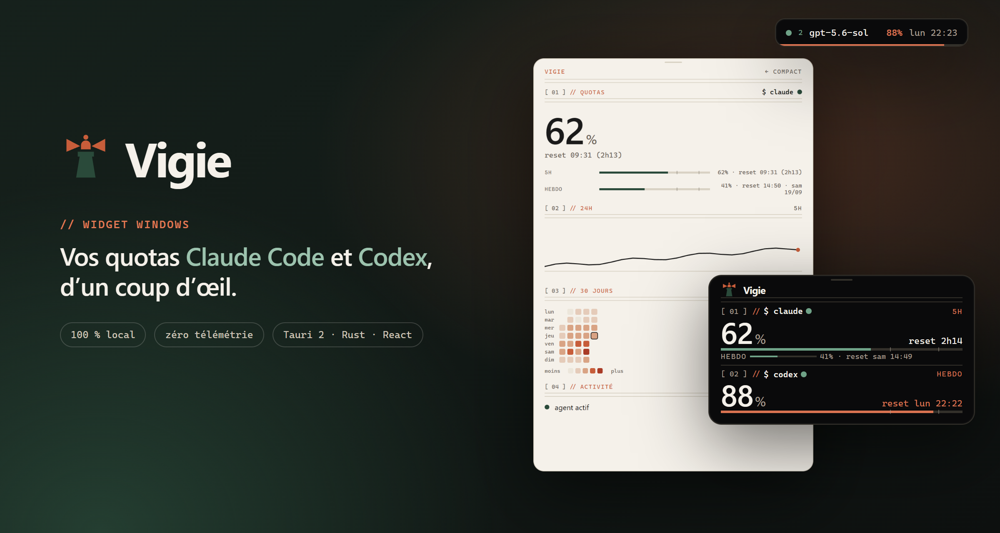
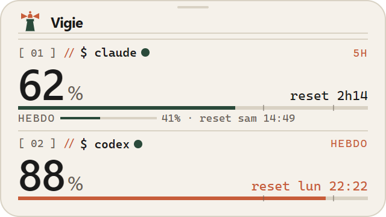
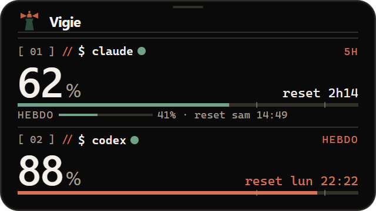
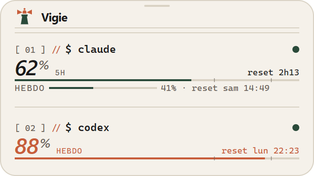
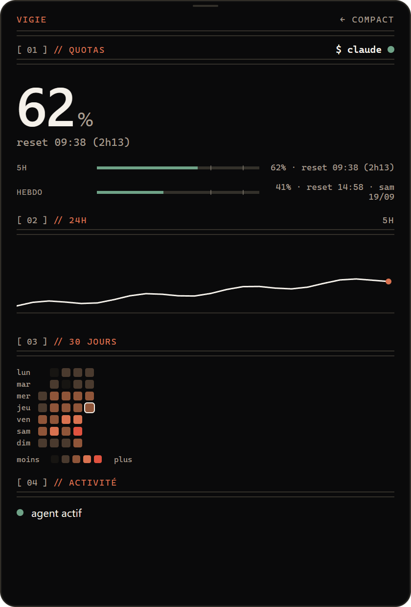
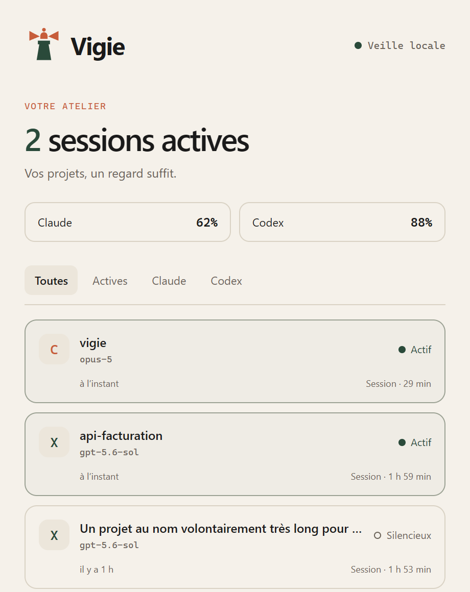
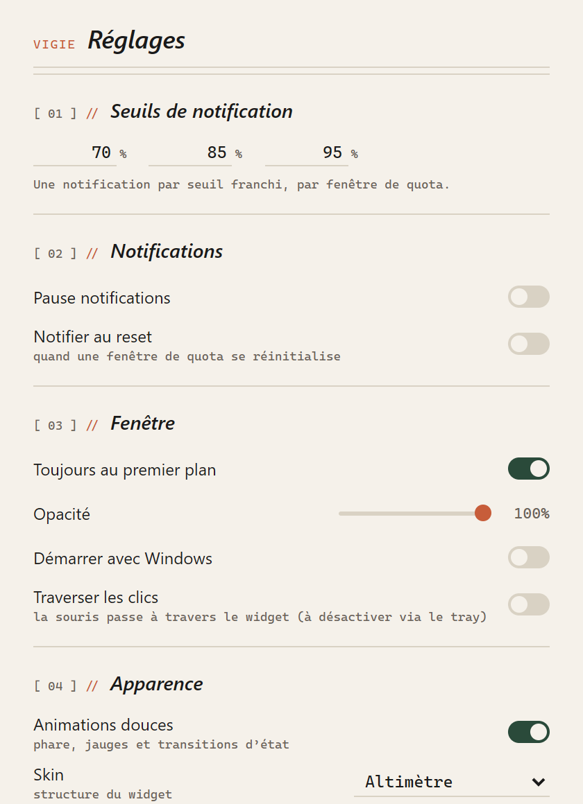
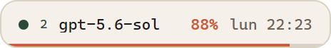
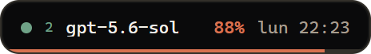

<p align="center">
  
</p>

<h1 align="center">Vigie</h1>

<p align="center">
  <strong>Vos quotas Claude Code et Codex, d’un coup d’œil.</strong><br>
  Un petit widget Windows flottant, 100 % local, sans télémétrie et sans installateur.
</p>

<p align="center">
  
  
  
</p>

> *English summary at the [end of this page](#in-english).*

---

## Pourquoi Vigie ?

**« Il me reste combien avant la limite, et ça se réinitialise quand ? »**
Vigie répond en permanence, dans un coin de l’écran :

- le pourcentage consommé sur la fenêtre de **5 heures** et sur la fenêtre **hebdomadaire** de Claude Code ;
- le quota **hebdomadaire** de Codex ;
- le compte à rebours avant chaque réinitialisation ;
- les sessions d’agents actives en ce moment, projet par projet.

## Aperçu

| Widget compact (clair) | Widget compact (sombre) | Skin « Carnet » |
|:---:|:---:|:---:|
|  |  |  |

| Vue détaillée | Fenêtre Sessions | Réglages |
|:---:|:---:|:---:|
|  |  |  |

**Mode HUD** : une seule ligne ancrée dans un coin de l’écran, pour les petits écrans.

&nbsp;&nbsp;

> Les captures sont réalisées avec les données fictives du mode démo (voir [Développement](#développement)).

## Fonctionnalités

- **Widget compact** 320 × 180 : sans bordure, transparent, toujours au premier plan, déplaçable.
- **Vue détaillée** par fournisseur (clic sur une bande) : toutes les fenêtres de quota,
  courbe des dernières 24 h et heatmap sur 30 jours.
- **Mode HUD** : une ligne de 232 × 34 px ancrée dans le coin de votre choix, qui alterne
  entre les fournisseurs actifs.
- **Fenêtre Sessions** : sessions Claude Code et Codex des dernières 24 h (projet, modèle,
  durée, actif ou silencieux), filtrables.
- **Icône de zone de notification** animée : un phare qui s’anime pendant l’activité,
  passe au rouge en quota critique et se grise quand les données sont périmées.
- **Notifications Windows** à des seuils réglables (70, 85 et 95 % par défaut), et en option
  à chaque réinitialisation.
- **Apparence** : deux skins (*Altimètre* et *Carnet*), thème clair, sombre ou automatique,
  opacité réglable, animations désactivables (la préférence « réduire les animations » de
  Windows est respectée).
- **Traverser les clics** : le widget reste visible mais laisse passer la souris.
- **Démarrage avec Windows** en option (désactivé par défaut).
- **Instance unique** : relancer Vigie ouvre la fenêtre Sessions de l’instance déjà lancée,
  sans démarrer un second poller.

## Données et vie privée

Un seul appel réseau : la lecture du quota Claude. Tout le reste est lu sur le disque.

| Source | Ce que Vigie lit | Ce qui sort de votre machine |
|---|---|---|
| **Claude Code** : quotas | Le jeton OAuth de Claude Code dans `~/.claude/.credentials.json` (lecture seule) | Une requête HTTPS vers `api.anthropic.com/api/oauth/usage`, **espacée d’au moins 5 minutes** |
| **Claude Code** : activité | Horodatage, dossier de projet et nom du modèle dans `~/.claude/projects/**/*.jsonl` | Rien |
| **Codex** : quotas et activité | Les événements de quota, le dossier de projet et le modèle dans `~/.codex/sessions/**/*.jsonl` | Rien |

En pratique :

- **Aucune télémétrie**, aucun service tiers, aucun compte à créer.
- Le jeton Claude est **lu, jamais stocké, jamais journalisé, jamais rafraîchi** par Vigie.
  Seul Claude Code renouvelle son jeton : Vigie attend simplement le suivant, afin de ne
  jamais déconnecter vos sessions en cours.
- Vigie parcourt ces journaux mais **n’en conserve que des métadonnées** (dossier du projet,
  modèle, horodatages, pourcentages de quota) : le contenu des conversations n’est ni
  stocké, ni affiché, ni transmis.
- Tout ce que Vigie écrit reste dans ses dossiers de données locaux (voir
  [Fichiers locaux](#fichiers-locaux)).
- L’interface est entièrement embarquée dans l’exécutable : aucune ressource distante n’est chargée.

Pour signaler un problème de sécurité, voir [SECURITY.md](SECURITY.md).

## Installation

Vigie se distribue **sans installateur** : vous compilez un exécutable portable.

### Prérequis

- Windows 10 ou 11 (x64)
- [Node.js](https://nodejs.org/) 20.19+ ou 22.12+
- [Rust](https://rustup.rs/) stable (1.88 ou plus récent), cible MSVC
- [Visual Studio Build Tools](https://visualstudio.microsoft.com/visual-cpp-build-tools/) avec la charge « Développement Desktop en C++ »
- WebView2 (déjà présent sur Windows 11)
- Claude Code et/ou Codex connectés sur la même session Windows

### Compiler

```powershell
git clone https://github.com/a8naaijetvi2lunk/vigie.git
cd vigie
npm ci
npm run tauri build -- --no-bundle
```

Résultat : `src-tauri\target\release\vigie.exe` (environ 13 Mo). **Lancez-le depuis ce
dossier** : ailleurs, le plugin de notification de Tauri s’identifie comme une application
installée et Windows risque de ne pas afficher les notifications. Le démarrage automatique
pointe lui aussi vers cet emplacement.

> **Exécutable non signé.** Au premier lancement, Windows SmartScreen peut afficher un
> avertissement. Si **Smart App Control** est actif, Windows peut refuser de lancer
> l’exécutable : c’est le comportement de cette protection envers les binaires non signés.

## Utilisation

- **Déplacer le widget** : glisser par la barre du haut.
- **Clic sur une bande** (Claude ou Codex) : vue détaillée. `← compact` pour revenir.
- **Survol du widget** : boutons Sessions, skin, thème et mode HUD.
- **Icône de la zone de notification** :
  - clic gauche : fenêtre Sessions ;
  - clic droit : afficher ou masquer, sessions actives, Réglages, premier plan, pause des
    notifications, démarrage avec Windows, traverser les clics, mode HUD, quitter.
- En mode **Traverser les clics**, le widget ne capte plus la souris : on le désactive depuis l’icône.

### Lire le widget

- **Pastille verte** : l’agent a écrit dans son journal il y a moins de 30 secondes.
- **Couleurs des barres** : vert sous 70 %, terracotta de 70 à 90 %, rouge au-delà.
- **« il y a 12 min »** à la place du libellé de fenêtre : la donnée est périmée.
  Claude est considéré périmé au-delà de 10 minutes ; Codex seulement après une
  réinitialisation, car sa valeur ne change que lorsque Codex tourne.
- **« reconnecte Claude Code »** : le jeton de Claude Code a expiré. Utilisez Claude Code
  une fois pour qu’il le renouvelle ; Vigie reprend tout seul dans les secondes qui suivent.

## Fichiers locaux

Réglages, historique, caches et journal sont rangés dans
`%APPDATA%\io.github.a8naaijetvi2lunk.vigie\` :

| Fichier | Contenu |
|---|---|
| `config.json` | Vos réglages |
| `history.db` | Historique SQLite des pourcentages (échantillons sur 25 h, agrégats journaliers sur 31 jours) |
| `claude-usage-cache.json`, `codex-usage-cache.json` | Dernière mesure connue, affichée dès le démarrage |
| `vigie.log` | Coupures et reprises de la source Claude (sans jeton), rotation à 256 Kio |
| `.window-state.json` | Position et taille des fenêtres |

Le profil WebView2 de l’interface est créé dans `%LOCALAPPDATA%\io.github.a8naaijetvi2lunk.vigie\`.

Le démarrage automatique, s’il est activé, ajoute la valeur `Vigie` sous
`HKCU\Software\Microsoft\Windows\CurrentVersion\Run`.

**Désinstaller** : décochez « Démarrer avec Windows », quittez Vigie, supprimez
l’exécutable et les deux dossiers `io.github.a8naaijetvi2lunk.vigie` (sous `%APPDATA%`
et `%LOCALAPPDATA%`).

## Limites connues

- **Windows uniquement** (registre, objets nommés Win32, fenêtre transparente).
- **Sources non documentées** : l’endpoint d’usage de Claude et le format des journaux
  Codex ne sont pas des API publiques. Une mise à jour de Claude Code ou de Codex peut
  casser leur lecture du jour au lendemain.
- **Limitation de débit côté Claude** : l’endpoint renvoie vite des erreurs 429. Vigie
  espace ses appels d’au moins 5 minutes (puis 10, 20, 40 et 60 minutes après des refus
  successifs), sauf au démarrage et juste après un renouvellement du jeton par Claude Code.
- **Intervalle Claude** : au-delà de 10 minutes, la mesure s’affiche comme périmée
  entre deux appels.
- **Codex n’expose que la fenêtre hebdomadaire** dans ses journaux, pas la fenêtre de 5 heures.
- **Quotas par compte** : ils concernent le compte du fournisseur, pas une session en particulier.
- **Interface en français** uniquement.

## Développement

```powershell
npm ci
npm run tauri dev          # application complète, avec rechargement à chaud
```

### Mode démo (sans Tauri, sans compte)

`npm run dev`, puis ouvrez dans un navigateur :

| URL | Vue |
|---|---|
| `http://localhost:1420/?demo` | Widget compact |
| `http://localhost:1420/?demo&dark` | Widget compact, thème sombre |
| `http://localhost:1420/?demo&hud` | Mode HUD |
| `http://localhost:1420/?demo#sessions` | Fenêtre Sessions |
| `http://localhost:1420/?demo#settings` | Réglages |

Ajoutez `&empty` (absence de données) ou `&still` (sans animations) **avant** le `#`,
par exemple `?demo&empty#sessions`.
Les données fictives ne s’activent que dans un navigateur avec `?demo`, jamais dans l’application.

### Tests

```powershell
npm run build                                       # TypeScript + build Vite
npm test                                            # tests front (node --test)
cargo test --manifest-path src-tauri/Cargo.toml     # tests Rust
```

Les tests reposent sur des fixtures : ils n’accèdent ni au réseau ni à vos comptes.
Un test Rust ignoré par défaut lit le vrai journal Codex de votre poste, pour diagnostic :
`cargo test --manifest-path src-tauri/Cargo.toml -- --ignored --nocapture`.

### Architecture (principaux fichiers)

```
src-tauri/src/          Rust : tout l’état de l’application vit ici
├── providers/          claude.rs (API d’usage, backoff), codex.rs (journaux JSONL)
├── sessions.rs         index des sessions actives (lecture incrémentale)
├── history.rs          historique SQLite
├── notifier.rs         notifications de seuil et de réinitialisation
├── tray_status.rs      icône animée de la zone de notification
├── config.rs           réglages persistés
└── lib.rs              fenêtres, menu, commandes IPC
src/                    React 19 + TypeScript : interface purement réactive
├── components/         CompactCard, ExpandedView, MiniHud, SessionsView, Settings
├── lib/                types miroirs du Rust, formatage, data-viz, mode démo
└── theme.css           source unique des design tokens
```

Le backend publie son état par événements (`usage-updated`, `sessions-updated`,
`config-updated`), écoutés par les fenêtres `main`, `settings` et `sessions`. Le front
reflète cet état ; seules quelques règles d’affichage sont dupliquées du Rust.

## Contribuer

Les issues et pull requests sont bienvenues. Avant de proposer une modification :
`npm run build`, `npm test` et `cargo test --manifest-path src-tauri/Cargo.toml` doivent passer.

## Avertissement

Vigie est un projet indépendant, **ni affilié ni approuvé** par Anthropic ou OpenAI.
Claude et Claude Code sont des marques d’Anthropic ; Codex est une marque d’OpenAI.

## Licence

[MIT](LICENSE)

---

## In English

**Vigie** is a small, floating Windows widget that shows your **Claude Code** (5-hour and
weekly windows) and **Codex** (weekly window) usage limits at a glance, with reset
countdowns, active agent sessions, threshold notifications, a one-line HUD mode and a
30-day history. It is built with Tauri 2, Rust and React.

- **Local-first**: no telemetry. The only network call is an HTTPS request to Anthropic’s
  usage endpoint, spaced at least 5 minutes apart, using the OAuth token Claude Code already
  stores on your machine. The token is read, never stored, logged or refreshed.
- **Codex** data comes from its local session logs. Only metadata is kept: conversation
  content is never stored, displayed or sent.
- **Build it yourself**: `npm ci` then `npm run tauri build -- --no-bundle`
  (requires Node.js 20.19+ or 22.12+, Rust 1.88+ MSVC and Visual Studio C++ Build Tools).
  Run the executable from `src-tauri\target\release` (elsewhere, Windows notifications may not show).
- **Try the UI without an account**: `npm run dev`, then open `http://localhost:1420/?demo`.
- The user interface is in French. The usage sources are undocumented and may break
  when Claude Code or Codex change.

Not affiliated with Anthropic or OpenAI. MIT licensed.
